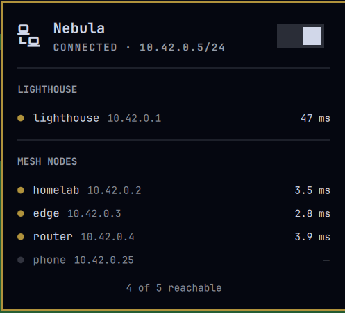
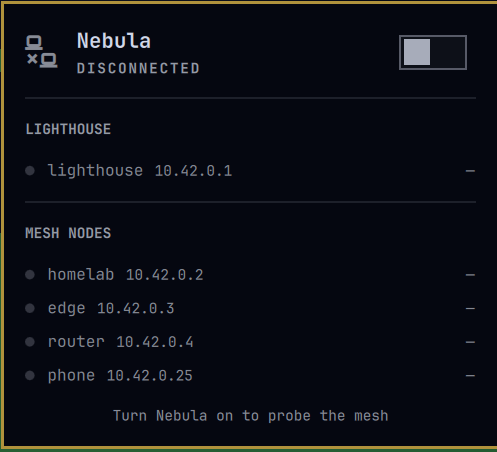

# Nebula VPN for the Omarchy bar

A bar widget for [Nebula](https://github.com/slackhq/nebula) mesh VPNs. It shows
whether your tunnel is up, turns it on and off, and lists which mesh nodes are
answering right now.



Left-click the bar icon for the panel; the switch turns the tunnel on and off.
When the tunnel is down, the icon dims and the node list greys out, because
nothing has been measured and a stale green dot would be a lie.



## Why the node list is configuration

Nebula has no `nebula status` the way Tailscale has `tailscale status`. A client
cannot ask the mesh who else is on it. The one component that knows is the
lighthouse, and reaching that knowledge means enabling Nebula's `sshd` debug
interface in `config.yml` — a privileged change this widget will not make for
you.

So the widget takes the node list from configuration and probes it directly with
a parallel ping sweep. What a dot means is exactly what a ping can prove: **this
peer answers over the tunnel.** It does not distinguish a direct tunnel from a
relayed one, and it does not show handshake state.

## Install

Review the repository, then add the plugin:

```bash
omarchy plugin add https://github.com/iryzhkov/omarchy-nebula.git
```

Accept the prompt to enable the plugin during installation.

For an unattended install from a repository you already trust:

```bash
omarchy plugin add https://github.com/iryzhkov/omarchy-nebula.git --enable --yes
```

## Configure your mesh

Find the widget's entry in `~/.config/omarchy/shell.json` and add a `nodes`
list. Leave your own host out of it — it is always reachable and would only pad
the count.

```json
{
  "id": "iryzhkov.nebula",
  "nodes": [
    { "name": "lighthouse", "address": "10.42.0.1", "role": "lighthouse" },
    { "name": "homelab",    "address": "10.42.0.2" },
    { "name": "edge",       "address": "10.42.0.3" },
    { "name": "router",     "address": "10.42.0.4" },
    { "name": "phone",      "address": "10.42.0.25" }
  ]
}
```

`role` is `"lighthouse"` or `"node"` and defaults to `"node"`; lighthouses get
their own section at the top of the panel. `address` must be a plain IPv4
literal — hostnames are rejected, because these addresses are interpolated into
the ping sweep.

`shell.json` hot-reloads, so the panel picks the list up on save.

### Other settings

| Key | Default | Meaning |
| --- | --- | --- |
| `unit` | `nebula.service` | The systemd unit to watch and toggle |
| `device` | `nebula1` | The tunnel interface to read the address from |
| `refreshIntervalSec` | `15` | How often to poll unit and interface state |
| `probeIntervalSec` | `5` | How often to sweep the mesh **while the panel is open** |

The ping sweep only runs while the panel is open. A closed panel costs two
cheap local commands every `refreshIntervalSec`.

## Toggling without a password prompt

Starting and stopping a systemd unit needs root. The widget tries plain
`systemctl` first and falls back to `pkexec`, which your desktop's polkit agent
turns into a password dialog. That works out of the box, but a password on every
toggle gets old.

To make the toggle a single click, install a polkit rule granting your user that
one unit. Save this as `/etc/polkit-1/rules.d/49-nebula.rules`, replacing
`yourname` with your username:

```javascript
polkit.addRule(function (action, subject) {
  if (action.id !== "org.freedesktop.systemd1.manage-units") {
    return undefined;
  }
  if (subject.user !== "yourname") {
    return undefined;
  }
  if (action.lookup("unit") !== "nebula.service") {
    return undefined;
  }

  var verb = action.lookup("verb");
  if (verb === "start" || verb === "stop" || verb === "restart") {
    return polkit.Result.YES;
  }

  return undefined;
});
```

Then `sudo systemctl restart polkit`.

The rule is deliberately narrow: one unit, three verbs, one user. It grants
nothing about any other service. Read it before installing it — this is a
privileged change to your system, and the plugin does not make it for you.

If you would rather keep the prompt, install nothing and the `pkexec` fallback
handles it.

## Interactions

| Where | Action | Result |
| --- | --- | --- |
| Bar icon | Left click | Open or close the panel |
| Bar icon | Right click | Toggle the VPN without opening the panel |
| Bar icon | Middle click | Force a refresh and ping sweep |
| Panel | Switch | Toggle the VPN |
| Panel | `Esc` | Close |

## IPC

```bash
omarchy-shell iryzhkov.nebula status      # "up 10.42.0.5/24 · 4/5 reachable"
omarchy-shell iryzhkov.nebula vpnOn
omarchy-shell iryzhkov.nebula vpnOff
omarchy-shell iryzhkov.nebula vpnToggle
omarchy-shell iryzhkov.nebula open
omarchy-shell iryzhkov.nebula close
omarchy-shell iryzhkov.nebula toggle      # the panel, not the VPN
omarchy-shell iryzhkov.nebula refresh
```

Bind one to a key in `~/.config/hypr/bindings.lua` if you want a shortcut;
keybindings stay yours, the plugin registers none.

## What this plugin does on your system

Enabled plugins run unsandboxed inside `omarchy-shell`. In full, this one:

- **Runs these commands:** `systemctl is-active <unit>`,
  `ip -4 -brief addr show <device>`, `bash -lc` with a `ping -c 1 -W 2` sweep of
  your configured addresses, `systemctl start|stop <unit>`, and
  `pkexec systemctl start|stop <unit>` when the plain call is refused.
- **Reads no files** of its own, beyond the settings Omarchy hands it from
  `shell.json`.
- **Writes nothing.**
- **Network access:** ICMP echo to the addresses you configure, over your own
  tunnel. It contacts nothing else, and reports nothing anywhere.
- **Background behavior:** two timers. The status poll runs whenever the widget
  is loaded; the ping sweep runs only while the panel is open.
- **Configuration outside the repository:** the `nodes` list in `shell.json`,
  and optionally the polkit rule described above.

## Validate from source

```bash
omarchy plugin validate .
```

## Update

```bash
omarchy plugin update iryzhkov.nebula
```

## License

MIT — see [LICENSE](LICENSE).
